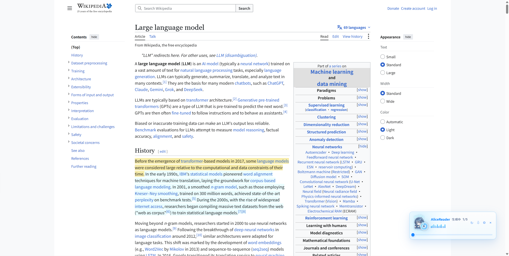
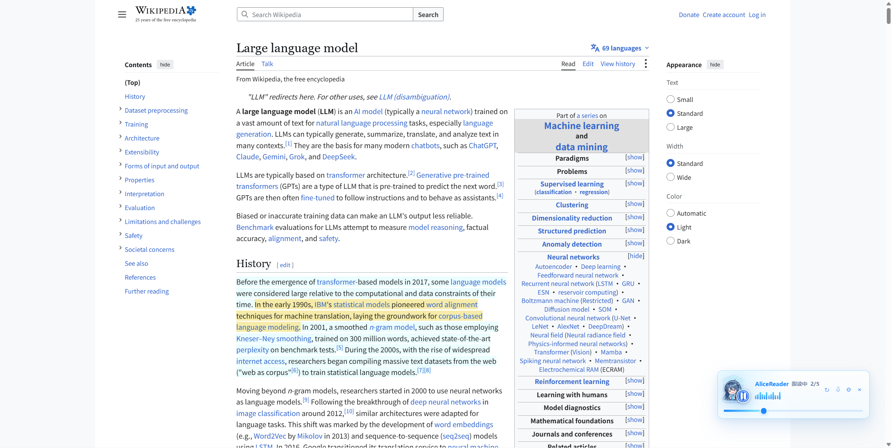
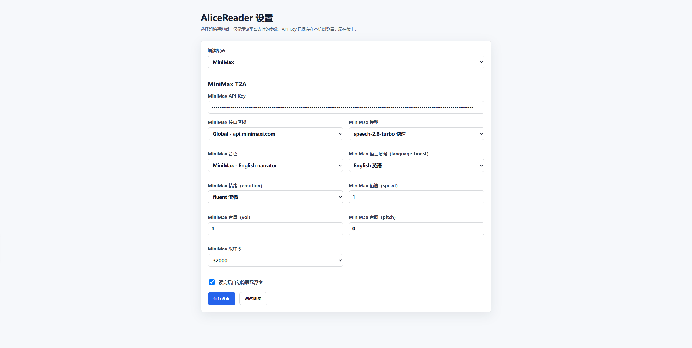

 

  
  <h2 align="center" style="font-weight: 600">AliceReader Browser Extension</h2>
  

    
    
    
  

  

    选中网页文本即可调用多平台语音合成，并在页面中显示可拖动播放器。
     
    <a href="https://github.com/moyuan10086/AliceReader-browser-extension"><strong>🌎 GitHub 仓库</strong></a>&nbsp;&nbsp;|&nbsp;&nbsp;
    <a href="https://github.com/moyuan10086/AliceReader-desktop"><strong>🖥️ 桌面版</strong></a>&nbsp;&nbsp;|&nbsp;&nbsp;
    <a href="LICENSE"><strong>📜 MIT License</strong></a>
  

## ✨ 特性

- 选中网页文本后快速朗读
- MiniMax、豆包 Speech、阿里百炼三渠道
- 按渠道切换音色、语言、情绪和速率参数
- 阿里百炼同时支持 Qwen3-TTS 与 CosyVoice
- 浮动播放器支持播放、暂停、重播、进度拖动和缓存
- 句子时间线高亮和朗读状态反馈
- API Key 仅保存在浏览器扩展本地存储

## 🖼️ 截图

## 📦 安装

1. 打开 `chrome://extensions/` 或 `edge://extensions/`。
2. 开启“开发者模式”。
3. 点击“加载已解压的扩展”。
4. 选择本目录。
5. 点击扩展图标进入设置页，选择渠道并填写对应 API Key。

## ⚙️ 渠道配置

### MiniMax

使用 MiniMax T2A 接口，支持 MiniMax Voice ID、`language_boost`、`emotion`、`speed`、`vol`、`pitch` 和采样率。

### 豆包 Speech

使用豆包 Speech 流式接口，参数包括模型、`speaker` 音色和采样率。

### 阿里百炼

Qwen3-TTS 使用 `language_type` 和指令参数；CosyVoice 使用独立的 `SpeechSynthesizer` 接口、CosyVoice 音色、`language_hints`、`rate`、`volume`、`pitch` 和采样率。

设置页会隐藏当前渠道不支持的字段，避免不同平台的 Voice ID 或情绪 ID 混用。

## ▶️ 使用

- 在网页中选中文本，点击浮动播放器的朗读按钮。
- 也可以使用右键菜单 `Read selected text aloud`。
- 快捷键：`Alt+Shift+S`。
- 使用 `test-page.html` 可快速验证扩展交互。

## 🛠️ 开发

本项目不需要构建工具，直接加载目录即可开发。修改 `src/` 后，在扩展管理页点击“重新加载”。

## ⚠️ 注意事项

- 浏览器内置页面、扩展商店页面和部分 PDF 阅读器不允许内容脚本运行。
- 阿里百炼 CosyVoice 当前接口仅适用于支持的地域和音色。
- 请勿将 API Key 写入源码或提交到 Git 仓库。
